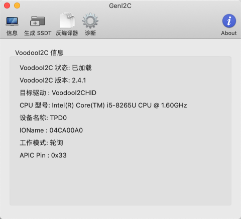
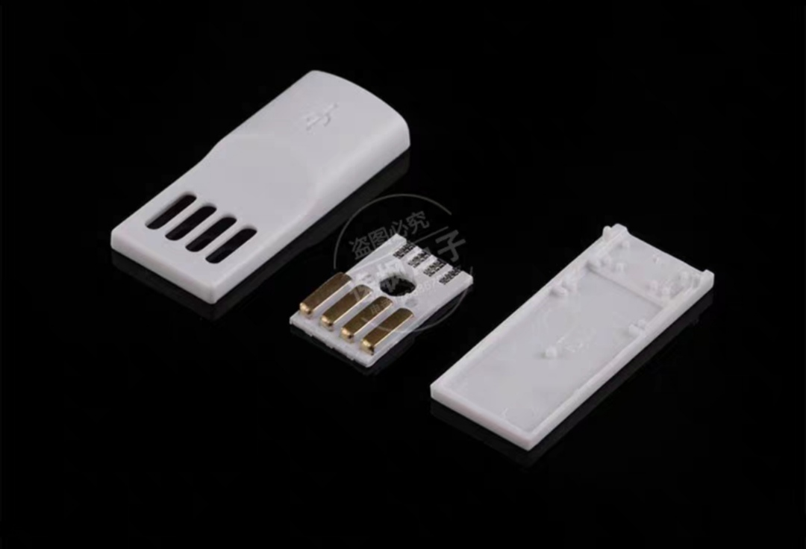
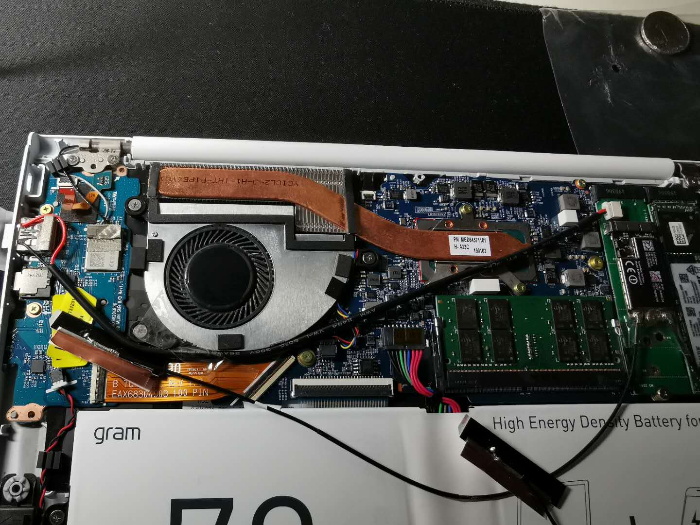

# LG-Gram13-Z990
Hackintosh MacOS on LG Gram13 Z990

**注意：本EFI不兼容Z980，因为Z990的芯片架构升级了**

Z980的朋友请移步一下项目：

clover：[https://github.com/ShiningXu/LG-Gram-macOS](https://github.com/ShiningXu/LG-Gram-macOS)

oc：[https://github.com/suzuke/LG-Gram-13z980-Opencore](https://github.com/suzuke/LG-Gram-13z980-Opencore)

## 配置

|      | 详情                                                      |
| ---- | --------------------------------------------------------- |
| 型号 | LG Gram13 Z990（2019年款与之前的型号DSDT并不通用）        |
| CPU  | Core i5-8265U                                             |
| 显卡 | Intel UHD Graphics 620（平台：Whiskey Lake）              |
| 内存 | 8G板载+16G                                                |
| 硬盘 | 1TB浦科特SSD（原装的已拆下）                              |
| 声卡 | Conexant CX8200                                           |
| 网卡 | 已替换为 BCM94360CS2（其中一个M.2口），原卡cnvi暂时没法搞 |

## 安装

安装教程就不多说了，在远景爬贴就好，目前还是用Clover引导，后期可能会折腾OC。

刚开始尝试用别人做好的EFI发现并不适合Z990，只能自己重新折腾。

## 更新 

### 8-27

- 修复电池电量信息，充电状态、电量值等都正确显示
- 去掉内存插槽数设置
- 经测试Z大的intel网卡驱动能够使用，最近用原生WiFi协议的驱动也能用，但网速较低自行衡量需求

## 驱动完善

- [x] 显卡：不是7代也不是8代好尴尬，仿冒id：0x3EA50004
  - HDMI输出正常；
  - 快捷键F2、F3调节亮度；
  - hidpi用one-key-hidpi，GitHub搜一下即有；（1080屏幕开不开其实差别也不大）
  
- [x] 声卡：注入id：21，fn+F11、F12调节声音正常，耳机孔正常

- [x] 蓝牙：两种方案，用Intel或者BCM的都可以，Intel的对于低功耗蓝牙有点不好，我选择了用BCM
  - Intel的蓝牙驱动在远景有大神做出来了，放到驱动文件夹就好；（罗技低功耗蓝牙鼠标基本用不了）
  - bcm的免驱但是需要自己走线，因为硬盘口不带USB，占用一个USB口，需要耗材：OTG转接头，不需要焊接；方案参考：https://github.com/ice-black-tea
  
- [x] 网卡：Intel的不折腾，装BCM免驱卡，买m.2 Mkey转接卡占用一个硬盘口

- [x] 电池：正常显示电量，提取DSDT修改，参考RehabMan大神的教程
  - ~~不满电状态下刚插上充电器会显示100%，一会就恢复正常数值，不影响使用后期再完善；~~
  - 电池用量正常，合上盖子一晚0耗电；
  - 电源管理正常，休眠唤醒正常；
  
- [x] 键盘、摄像头正常

- [x] I2C触摸板：能驱动，~~但是LG BIOS的问题，单指点击几下后会失效一定时间，勉强能用~~

  - 驱动方法，添加补丁 change _OSI to XOSI，配合SSDT-XOSI.aml（其实就是系统补丁）
  - 原理：APIC Pin:0x33 可以直接用轮询模式，无需修改为中断模式

  - 05.18 更新驱动解决之前单指点击三下后失效问题（VoodooI2C、VoodooI2CHID）

  

- [x] 雷电3：能驱动，不过没有设备测试热插拔，平时只用来充电

- [x] USB：最好自行定制一下USB端口~~Gram14应该可以直接使用，如果是Gram15、17的需要自行定制（因为我不用Intel蓝牙所以屏蔽了该端口）~~

## 未解决

- Intel网卡：不纠结，虽然论坛有大神在做驱动；
- SD读卡器：还没时间弄，应该可以驱动吧，主要是没有用到；

# 另外

有朋友问到关于上拆机卡蓝牙走线问题

耗材：usb金手指，中间两个端子就是d+/d-，把蓝牙线焊接在金手指上就无需动主板了，外壳可以不用，我只用了中间那块零件

走线：转接卡带蓝牙线，处理线材时注意不要用力过猛（原本线很长的··被我弄得剩下这么短刚刚好）

==这里需要配合定制USB口，屏蔽了原本intel蓝牙的usb端口，然后bcm的蓝牙就正常使用==

CFG Lock：0x3E  值：1 -> 0

DVMT Pre-Allocated：0xEE 值：1 -> 2 （改成64M应该够了）

DVMT Total Gfx Mem：0xEF （此项不知道是否需要改）

## 感谢

黑果就是折腾，感谢远景各位大神的教程，由于参考太多不一一列出。
